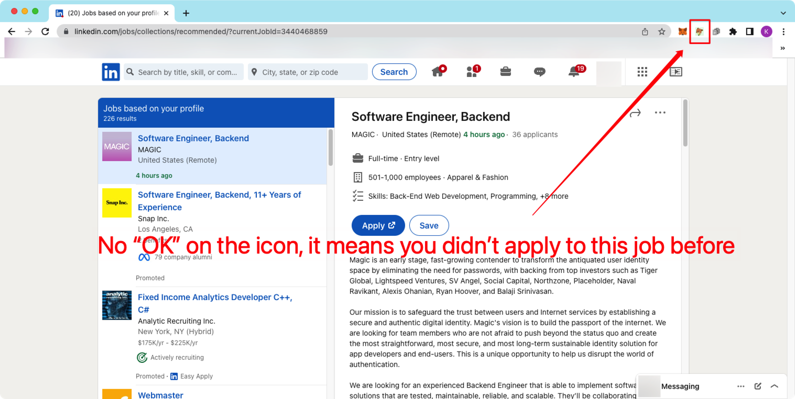
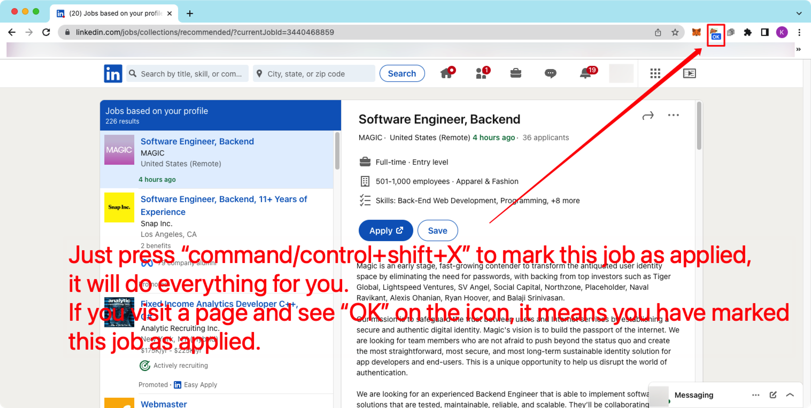
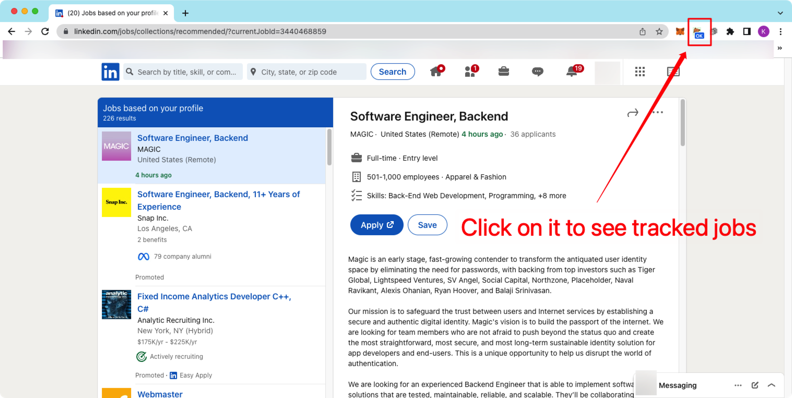
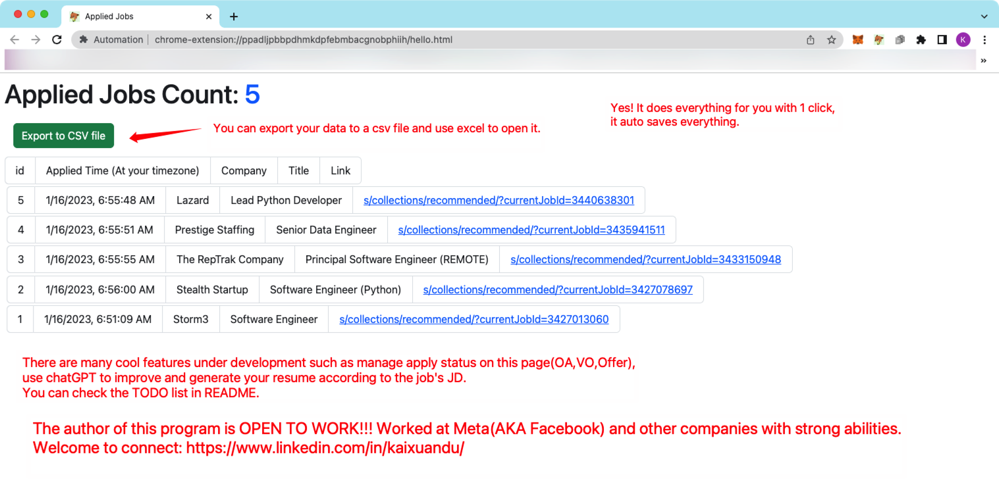

# Automation

The author of this program is OPEN TO WORK!!! Worked at Meta(AKA Facebook) and other companies with strong abilities. 
Welcome to connect: https://www.linkedin.com/in/kaixuandu/

TL;DR;
A job hunting Chrome Extension. 
Track applied jobs' page url by 1 click. It will save everything you need. 
Demo in 1 minute:

Yes! It does everything for you with 1 click, it auto saves everything.

You can export your data to a csv file and use excel to open it.

There are many cool features under development such as manage apply status on this page(OA,VO,Offer), use chatGPT to improve and generate your resume according to the job's JD. You can check the TODO list in README.

More than "So you don't need to copy and paste company name from that page to an excel".

1. Why you need this?
   1) Are you tired of tracking applied jobs? Have to copy and paste job desc to an excel. After applying to too many jobs even don't know whether have applied to this job before.  
   2) Automation tracks a Job JD page's url, you can mark a page as applied by pressing "cmmand/control+shift+X", if you visit a marked page there will be a "OK" mark on the icon, so you know you have applied to this job before.  
   3) When you press "cmmand/control+shift+X", Automation will not only record the job link, but also will auto record the job's company and title and applied time(Now only support Linkedin for this feature, other websites will soon be supported).  
   4) You can check all applied jobs info on a web page by clicking on the icon. You can export all your applied job info to a .csv file on that page.  
   5) And there are many cool features under development!  
 
2. How it can help and how to use?
   1) Install Automation to your chrome.
   2) Ping it on menu bar.
   3) Open a job JD page(Recommend Linkedin for full function).
   4) Press "cmmand+shift+X" to mark this job as applied. You will see "OK" on the Automation icon.
   5) Apply to this job.
   6) Click on the Automation icon to view all applied jobs.

Warning:
This program's data is storaged in your Chrome, if you remove Automation or delete Chrome your data will be deleted, please export csv file before you do something dangerous.

TODOs
urgent:
- [ ] bug need to be fixed: linkedin same job recorded as different jobs because link is different on different pages. How to fix: record unique job id.

planed
- [ ] Manage applies on page(Sort by time, Set status (OA, VO, Offer) )
- [ ] Make page more goodlooking
- [ ] Auto fill when apply ( Auto apply )
- [ ] Add regex related functions to analyze job info and support other webs( Indeed, Handshake, general webs )
- [ ] Use chatGPT to improve and generate resume for every job position
- [ ] TaskScheduled JD-targeted-resume full-auto apply

